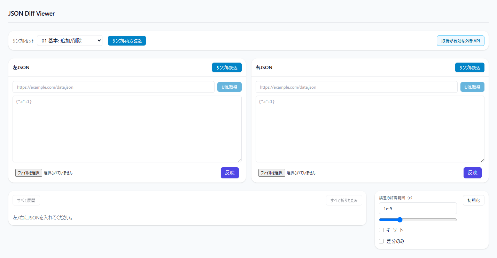

# JSON Diff Viewer

<p>
  <a href="https://json-diff-viewer.vercel.app/">
    
  </a>
</p>

<p>
  
  
  
</p>

**ファイル／外部APIのJSON**を左右で読み込み、**ツリー形式**の差分を可視化するツール。  
コピーや**差分一覧**のダウンロードも可能です。

## デモ

公開URL：https://json-diff-viewer.vercel.app/

[](https://json-diff-viewer.vercel.app/)

## スクリーンショット

<table>
  <tr>
    <td style="padding:6px;">
      
    </td>
  </tr>
  <tr>
    <td style="padding:6px;">
      
    </td>
  </tr>
  <tr>
    <td style="padding:6px;">
      
    </td>
  </tr>
  <tr>
    <td style="padding:6px;">
      
    </td>
  </tr>
</table>

## 特徴

- **入力ソース**
  - ファイルインポート（`.json`）
  - **外部API**：アプリ内プロキシ（`/api/proxy?url=...`）経由で取得（許可ホストのみ）
  - **サンプルセット（1〜7）**：`public/samples/<dir>/{left,right}.json` を選択読込・両方読込
  - **外部APIガイド**：画面から利用可能なエンドポイント一覧＆左右へのワンクリック挿入
- **差分表示**
  - ツリー表示（すべて展開／折りたたみ）
  - パスのコピー（Copy）、差分のみ表示、キーソート
  - 値ノードは left → right の短い要約
- **エクスポート**
  - 差分一覧（JSON） と Patch風（配列） をダウンロード
- **セキュアなプロキシ**
  - サーバ側で **許可ホスト**（ALLOWED_ORIGINS） をチェックして外部取得を制限

## 使い方

1. 画面上部の**サンプルセット**から `サンプル両方読込` → すぐ比較  
   あるいは左右パネルで**URL**を入力し `URL取得` → **反映**  
   （外部APIガイド → 一覧から 左／右／両方 セット → URL取得 → 反映）
2. 誤差の許容範囲（ε） や 差分のみ表示、キーソート で調整
3. 右側のサマリで件数を確認し、必要なら 差分一覧／Patch をダウンロード

## セットアップ

```bash
npm i
npm run dev
```

- 本番ビルド：`npm run build`
- プレビュー：`npm run start`

## 画面構成

- **上段（入力）**：サンプルセット選択／サンプル両方読込／外部APIガイド
- **左右パネル**：URL入力＋取得、テキスト編集、**反映**、ファイルインポート
- **右カラム**：
  - 誤差の許容範囲（ε）／テキスト入力／指数スライダー
  - サマリ（追加・削除・変更の件数 / ダウンロードボタン）
- **メイン**：ツリー差分（Copy／展開・折りたたみ）

## ディレクトリ構成（抜粋）

```bash
src/
├─ app/
│ ├─ components/
│ │ ├─ Uploaders.tsx    # 上段ツールバー＋左右パネル（URL取得/反映/サンプル/ファイル）
│ │ ├─ ApiGuide.tsx     # 取得が有効な外部APIの一覧（単体/比較ペア）
│ │ ├─ Controls.tsx     # ε・差分のみ・キーソート・初期化
│ │ ├─ DiffTree.tsx     # ツリー差分（コピー/展開/折りたたみ）
│ │ └─ Summary.tsx      # 追加/削除/変更の集計とダウンロード
│ ├─ api/proxy/route.ts # 外部APIプロキシ（許可ホストのみ）
│ ├─ page.tsx
│ └─ globals.css        # 共通UIトークン
└─ lib/diff/*.ts        # diffロジック・型・patch生成
```

## 技術スタック

- **Next.js (App Router) + TypeScript**
- **Tailwind CSS v3**

## デプロイ（Vercel）

- GitHubから Import Project（Framework=Next.js）
- 環境変数：`ALLOWED*ORIGINS` / `NEXT_PUBLIC_ALLOWED_ORIGINS` / `NEXT_PUBLIC_API_*` を登録
- Deploy → `*.vercel.app` が発行
